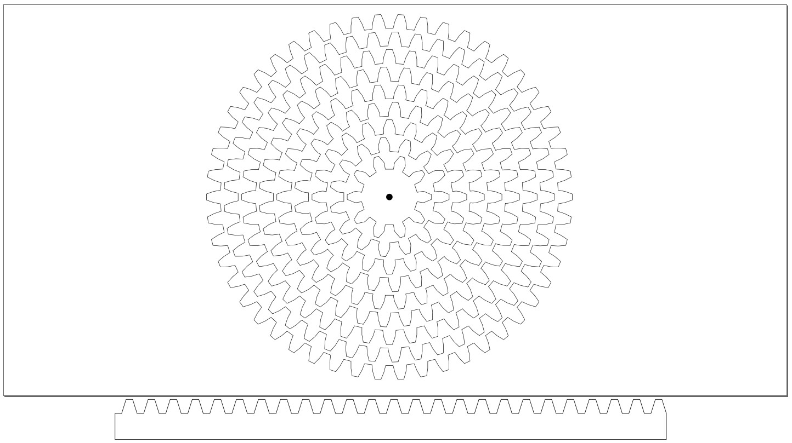
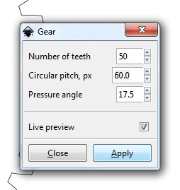

# Geartrain challenge
*January 2017*

* A workshop challenge for a group of people in a Fab Lab
* The participants must fabricate enough gears to make a gear train that encircles a square column
* Each gear must be personalized with an engraving or cutouts shapes from the middle
* The biggest challenge is to make a gear type that can turn 90 degrees around the column corners
* As a flying start the particapants are provided with the gear collection bellow
* The longer the geartrain, the bigger the success!

### Download

[Inkskape source](./Gear_collection__circular_pitch_60.0__pressure_angle_17.5.svg)

[Illustrator file](./Gear_collection__circular_pitch_60.0__pressure_angle_17.5.ai)

[Rhino3D file](./Gear_collection__circular_pitch_60.0__pressure_angle_17.5.3dm)

[DXF file](./Gear_collection__circular_pitch_60.0__pressure_angle_17.5.dxf)

### Inkscape settings for generating a new gear

* Set document units to "mm" in properties
* Go to -Extension -Render -Gear
* Circular pitch = 60
* Pressuere angle = 17.5
* Choose your own tooth count and your gear will be compatible with the collection

[Download InkScape](www.inkscape.org)

